# Class 7: Machine Learning
Ian Gurholt (PID: A16767484)

Today we are going to learn how to apply different machine learning
methods, beginning with clustering:

The goal here is to find groups/clusters in your input data.

First I will make up some data with clear groups.For this I will use the
’rnorm()’function.

``` r
rnorm(10)
```

     [1]  1.26769711 -2.18369675  1.37360671  0.86583288 -0.58835691 -0.67406924
     [7]  0.99697949  1.61786479  0.20814670  0.01839465

``` r
hist(rnorm(10000, mean=3))
```

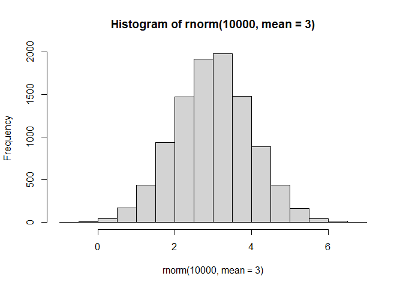

``` r
x<-(c(rnorm(10000, -3), rnorm(10000,3)))
hist(x)
```

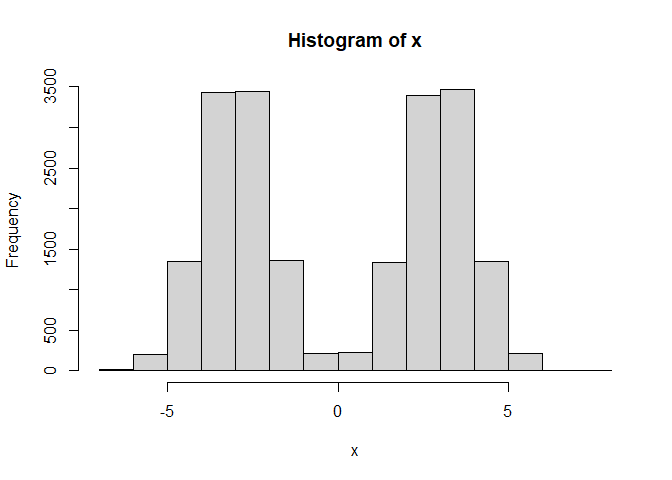

``` r
n<-30
x<-(c(rnorm(n, -3), rnorm(n,3)))
y <- rev(x)

z<-cbind(x,y)
head(z)
```

                 x        y
    [1,] -3.534706 2.805592
    [2,] -4.936886 2.047241
    [3,] -2.909551 3.357713
    [4,] -2.074906 2.582421
    [5,] -3.581621 3.508676
    [6,] -2.475895 1.337412

``` r
plot(z)
```

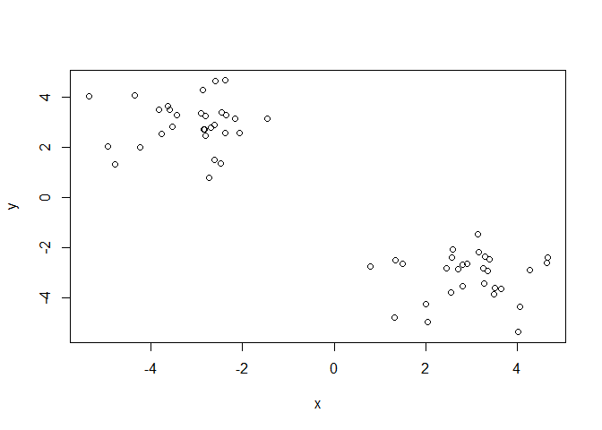

Use the kmeans() function setting k to 2 and nstart=20

Inspect/print the results

Q. How many points are in each cluster? Q. What ‘component’ of your
result object details - cluster size? - cluster assignment/membership? -
cluster center?

Plot x colored by the kmeans cluster assignment and add cluster centers
as blue points

``` r
km<-kmeans(z, centers=2)
km
```

    K-means clustering with 2 clusters of sizes 30, 30

    Cluster means:
              x         y
    1 -3.117991  2.936470
    2  2.936470 -3.117991

    Clustering vector:
     [1] 1 1 1 1 1 1 1 1 1 1 1 1 1 1 1 1 1 1 1 1 1 1 1 1 1 1 1 1 1 1 2 2 2 2 2 2 2 2
    [39] 2 2 2 2 2 2 2 2 2 2 2 2 2 2 2 2 2 2 2 2 2 2

    Within cluster sum of squares by cluster:
    [1] 50.63928 50.63928
     (between_SS / total_SS =  91.6 %)

    Available components:

    [1] "cluster"      "centers"      "totss"        "withinss"     "tot.withinss"
    [6] "betweenss"    "size"         "iter"         "ifault"      

Results in kmeansobject ‘km’

``` r
attributes(km)
```

    $names
    [1] "cluster"      "centers"      "totss"        "withinss"     "tot.withinss"
    [6] "betweenss"    "size"         "iter"         "ifault"      

    $class
    [1] "kmeans"

Cluster Size?

``` r
km$size
```

    [1] 30 30

cluster assignment/membership?

``` r
km$cluster
```

     [1] 1 1 1 1 1 1 1 1 1 1 1 1 1 1 1 1 1 1 1 1 1 1 1 1 1 1 1 1 1 1 2 2 2 2 2 2 2 2
    [39] 2 2 2 2 2 2 2 2 2 2 2 2 2 2 2 2 2 2 2 2 2 2

Cluster center?

``` r
km$centers
```

              x         y
    1 -3.117991  2.936470
    2  2.936470 -3.117991

> Q. Plot x colored by the kmeans cluster assignment and add cluster
> centers as blue points

``` r
plot(z)
```


R will recycle the shorter color vector to be the same length as the
longer (number of data points) in z

``` r
plot(z, col=c("red", "blue"))
```

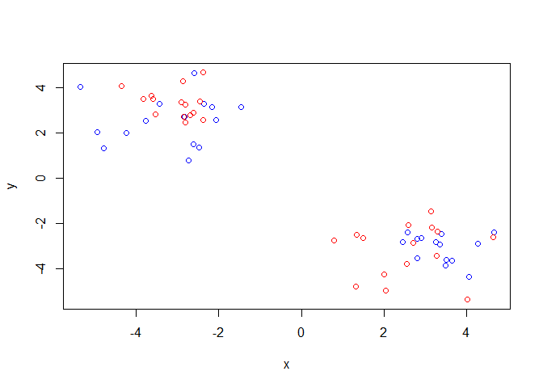

``` r
plot(z, col= 2)
```

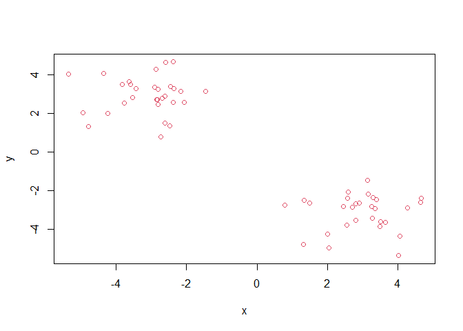

``` r
plot(z, col=km$cluster)
```

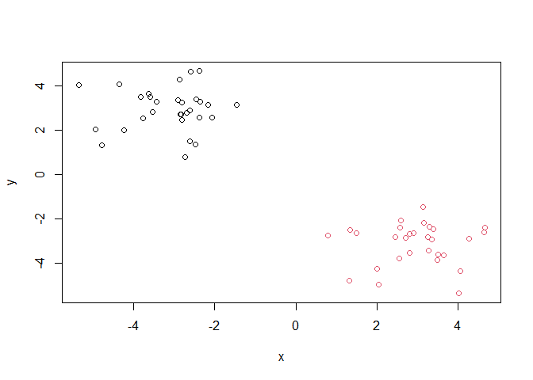

We can use the ‘points()’ function to add new points to an existing
plot…like the cluster centers

``` r
plot(z, col=km$cluster)
points(km$centers, col= "blue", pch=15, cex=3)
```

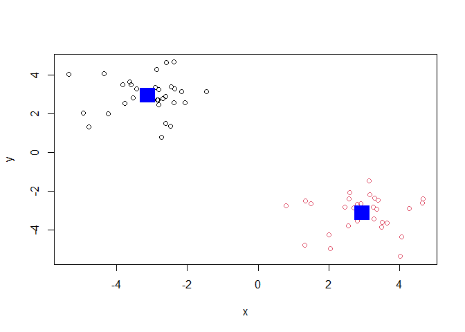

> Q. Can you run kmeans and ask for 4 clusters please and plot the
> results like we have done above

``` r
km4<-kmeans(z, centers=4)
km4
```

    K-means clustering with 4 clusters of sizes 19, 19, 11, 11

    Cluster means:
              x         y
    1 -2.531723  2.917052
    2  2.917052 -2.531723
    3 -4.130637  2.970009
    4  2.970009 -4.130637

    Clustering vector:
     [1] 3 3 1 1 3 1 3 1 1 1 3 1 1 3 1 1 1 3 1 3 1 3 1 1 3 1 1 3 1 1 2 2 4 2 2 4 2 2
    [39] 4 2 4 2 4 2 2 2 4 2 2 4 2 2 2 4 2 4 2 2 4 4

    Within cluster sum of squares by cluster:
    [1] 20.41994 20.41994 12.38935 12.38935
     (between_SS / total_SS =  94.5 %)

    Available components:

    [1] "cluster"      "centers"      "totss"        "withinss"     "tot.withinss"
    [6] "betweenss"    "size"         "iter"         "ifault"      

``` r
plot(z, col=km4$cluster)
points(km4$centers, col= "blue", pch=15, cex=3)
```

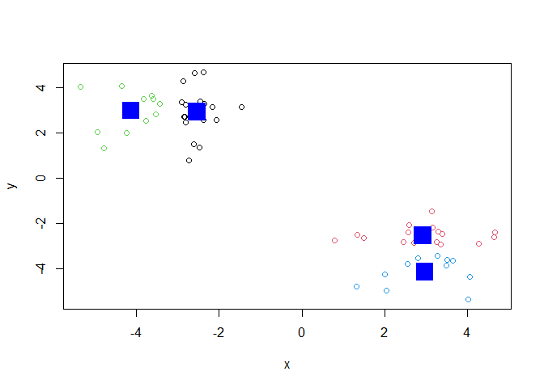

## Heiarchical Clustering

Lets take our same made up data ‘z’ and see how hclust works

First we need a distance matrix of our data to be clustered.

``` r
d<- dist(z)
hc<- hclust(d)
hc
```


    Call:
    hclust(d = d)

    Cluster method   : complete 
    Distance         : euclidean 
    Number of objects: 60 

``` r
plot(hc)
abline(h=8, col="red")
```

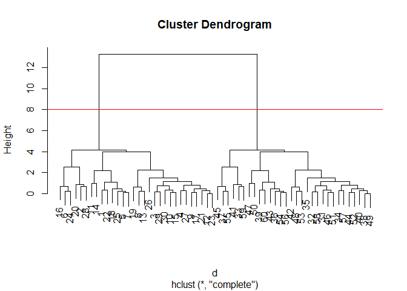

I can get my cluster membership vector by “cutting the tree” with the
`cutree()` function like so:

``` r
grps<- cutree(hc,h=8)
grps
```

     [1] 1 1 1 1 1 1 1 1 1 1 1 1 1 1 1 1 1 1 1 1 1 1 1 1 1 1 1 1 1 1 2 2 2 2 2 2 2 2
    [39] 2 2 2 2 2 2 2 2 2 2 2 2 2 2 2 2 2 2 2 2 2 2

Can you plot `z` colored by our hclust results:

``` r
plot(z, col=grps)
```


## PCA of UK Food Data

Read data from UK dept of food consumption in different parts of the UK

``` r
url <- "https://tinyurl.com/UK-foods"
x <- read.csv(url)
head(x)
```

                   X England Wales Scotland N.Ireland
    1         Cheese     105   103      103        66
    2  Carcass_meat      245   227      242       267
    3    Other_meat      685   803      750       586
    4           Fish     147   160      122        93
    5 Fats_and_oils      193   235      184       209
    6         Sugars     156   175      147       139

> Q1. How many rows and columns are in your new data frame named x? What
> R functions could you use to answer this questions?

Can use the `dim()` function in order to specify dimensions of a data
frame

``` r
dim(x)
```

    [1] 17  5

There are a total 17 rows and 5 columns in the original data frame

``` r
url <- "https://tinyurl.com/UK-foods"
x <- read.csv(url, row.name=1)
head(x)
```

                   England Wales Scotland N.Ireland
    Cheese             105   103      103        66
    Carcass_meat       245   227      242       267
    Other_meat         685   803      750       586
    Fish               147   160      122        93
    Fats_and_oils      193   235      184       209
    Sugars             156   175      147       139

> Q2. Which approach to solving the ‘row-names problem’ mentioned above
> do you prefer and why? Is one approach more robust than another under
> certain circumstances?

I prefer to use the second method where we specified `row.names=1`
meaning that we want to first column to be the names of the food and not
the row numbers. This is a much quicker and efficient way as it is all
condensed in a single function, however this may not be as robust as the
first method as it only rids of numbered rows and if we wanted to get
rid of the entire first column, given it was not just solely row
numbers, we would then have to use the first method as it can remove the
whole column and any content within it over and over again.

Maybe bar plots show some trends?

``` r
barplot(as.matrix(x), beside=T, col=rainbow(nrow(x)))
```


> Q3: Changing what optional argument in the above barplot() function
> results in the following plot?

Adjusting the `beside` function in the code from T to F will
consequently make a vertically stacked bar plot instead of plots aligned
next to each other

``` r
barplot(as.matrix(x), beside=F, col=rainbow(nrow(x)))
```


No obvious trend with the barplot…

A so called Pairs Plot can be useful for small datasets like this one

``` r
pairs(x, col=rainbow(10), pch=16)
```


> Q5: Generating all pairwise plots may help somewhat. Can you make
> sense of the following code and resulting figure? What does it mean if
> a given point lies on the diagonal for a given plot?

The code produces a pair plot by which in this case compares two
countries and a given food variable to assess any differences between
the two countries, if the points fall along the diagonal than one can
assume that there are few differences between the two locations and
similarities exist, however if the points fall above or below this
diagonal, than differences do exist however the way these plots are
represented makes it challenging to precisely understand the extent of
these differences as many point lie very close to this diagonal and it
is unclear whether one plot is more representative than the other.

> Q6. What is the main differences between N. Ireland and the other
> countries of the UK in terms of this data-set?

Its hard to see structure and trends in even this small dataset. Many
points appear to lie on the diagonal and some are just slightly off,
however the extent of this variation is unclear. How will we ever do
this when we have big datasets with 1000s of things we are measuring…

### PCA to the rescue

Let’s see how PCA deals with this data set. So main function in base R
to do PCA is called `prcomp()`

``` r
pca<- prcomp(t(x))
summary(pca)
```

    Importance of components:
                                PC1      PC2      PC3       PC4
    Standard deviation     324.1502 212.7478 73.87622 3.176e-14
    Proportion of Variance   0.6744   0.2905  0.03503 0.000e+00
    Cumulative Proportion    0.6744   0.9650  1.00000 1.000e+00

Let’s see what is inside this `pca` object that we created from running
`prcomp()`

``` r
attributes(pca)
```

    $names
    [1] "sdev"     "rotation" "center"   "scale"    "x"       

    $class
    [1] "prcomp"

``` r
pca$x
```

                     PC1         PC2        PC3           PC4
    England   -144.99315   -2.532999 105.768945 -4.894696e-14
    Wales     -240.52915 -224.646925 -56.475555  5.700024e-13
    Scotland   -91.86934  286.081786 -44.415495 -7.460785e-13
    N.Ireland  477.39164  -58.901862  -4.877895  2.321303e-13

> Q7. Complete the code below to generate a plot of PC1 vs PC2. The
> second line adds text labels over the data points.

``` r
plot(pca$x[,1],pca$x[,2], col=c("black", "red", "blue","darkgreen"),pch=16, xlab="PC1 (67.4%)", ylab="PC2 (29%)")
text(pca$x[,1], pca$x[,2], colnames(x))
```

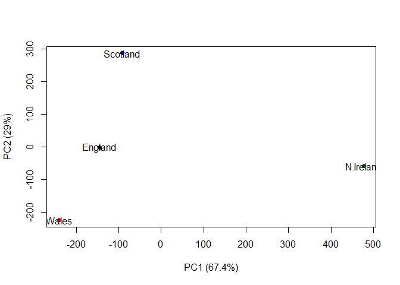

> Q8. Customize your plot so that the colors of the country names match
> the colors in our UK and Ireland map and table at start of this
> document.

``` r
plot(pca$x[,1],pca$x[,2] ,pch=16, xlab="PC1 (67.4%)", ylab="PC2 (29%)", xlim=c(-270, 500))
text(pca$x[,1], pca$x[,2], colnames(x), col=c("orange", "red", "blue","darkgreen"))
```

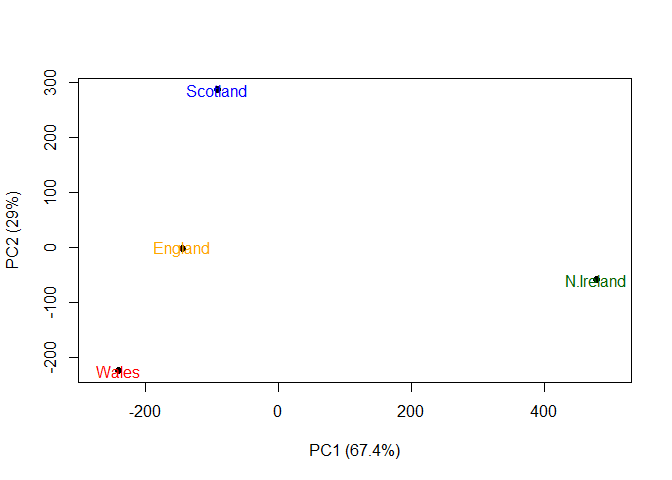

``` r
v <- round( pca$sdev^2/sum(pca$sdev^2) * 100 )
v
```

    [1] 67 29  4  0

``` r
z <- summary(pca)
z$importance
```

                                 PC1       PC2      PC3          PC4
    Standard deviation     324.15019 212.74780 73.87622 3.175833e-14
    Proportion of Variance   0.67444   0.29052  0.03503 0.000000e+00
    Cumulative Proportion    0.67444   0.96497  1.00000 1.000000e+00

``` r
barplot(v, xlab="Principal Component", ylab="Percent Variation")
```


\##PCA Loading Scores

``` r
par(mar=c(10, 3, 0.35, 0))
barplot( pca$rotation[,1], las=2 )
```


> Q9: Generate a similar ‘loadings plot’ for PC2. What two food groups
> feature prominantely and what does PC2 maninly tell us about?

``` r
par(mar=c(10, 3, 0.35, 0))
barplot( pca$rotation[,2], las=2 )
```


The two food groups that feature primarily in this graph is fresh
potatoes and soft drinks and overall PC2 shows us a cleaner version of
PC1 in which we can better decipher the skew of North Ireland to the
right of the PCA being a result of soft drinks and the the skewing of
the other countries to the left of the PCA being a result of the fresh
potatoes negative value.

\##PCA of RNA Seq Data

``` r
url2 <- "https://tinyurl.com/expression-CSV"
rna.data <- read.csv(url2, row.names=1)
head(rna.data)
```

           wt1 wt2  wt3  wt4 wt5 ko1 ko2 ko3 ko4 ko5
    gene1  439 458  408  429 420  90  88  86  90  93
    gene2  219 200  204  210 187 427 423 434 433 426
    gene3 1006 989 1030 1017 973 252 237 238 226 210
    gene4  783 792  829  856 760 849 856 835 885 894
    gene5  181 249  204  244 225 277 305 272 270 279
    gene6  460 502  491  491 493 612 594 577 618 638

> Q10: How many genes and samples are in this data set?

``` r
dim(rna.data)
```

    [1] 100  10

Given that genes are rows and samples are colunms, the `dim()` function
shows that there are 100 genes and 10 samples
