# Class 10: Halloween Mini Project
Ian Gurholt (PID:A16767484)

\##Importing Data

``` r
candy_file <- "candy-data.csv"


candy = read.csv(candy_file, row.names=1)
head(candy)
```

                 chocolate fruity caramel peanutyalmondy nougat crispedricewafer
    100 Grand            1      0       1              0      0                1
    3 Musketeers         1      0       0              0      1                0
    One dime             0      0       0              0      0                0
    One quarter          0      0       0              0      0                0
    Air Heads            0      1       0              0      0                0
    Almond Joy           1      0       0              1      0                0
                 hard bar pluribus sugarpercent pricepercent winpercent
    100 Grand       0   1        0        0.732        0.860   66.97173
    3 Musketeers    0   1        0        0.604        0.511   67.60294
    One dime        0   0        0        0.011        0.116   32.26109
    One quarter     0   0        0        0.011        0.511   46.11650
    Air Heads       0   0        0        0.906        0.511   52.34146
    Almond Joy      0   1        0        0.465        0.767   50.34755

> Q1. How many different candy types are in this dataset?

``` r
nrow(candy)
```

    [1] 85

There are 85 different types of candy in the data set, each with their
own row and found using nrow() function.

Q2. How many fruity candy types are in the dataset?

``` r
sum(candy$fruity)
```

    [1] 38

There are 38 types of fruity candy in the data set by suming up all of
the fruity column using the `sum()` function.

\##Favorite Candy

> Q3. What is your favorite candy in the dataset and what is it’s
> winpercent value?

``` r
candy["Snickers", ]$winpercent
```

    [1] 76.67378

My favorite candy is Snickers and its win percentage is 76,67%

> Q. Can you find all the candies with a win percent above 50 that are
> fruity?

``` r
library(dplyr)
```


    Attaching package: 'dplyr'

    The following objects are masked from 'package:stats':

        filter, lag

    The following objects are masked from 'package:base':

        intersect, setdiff, setequal, union

``` r
candy |>
  filter(winpercent>50) |>
  filter(fruity==1)
```

                                chocolate fruity caramel peanutyalmondy nougat
    Air Heads                           0      1       0              0      0
    Haribo Gold Bears                   0      1       0              0      0
    Haribo Sour Bears                   0      1       0              0      0
    Lifesavers big ring gummies         0      1       0              0      0
    Nerds                               0      1       0              0      0
    Skittles original                   0      1       0              0      0
    Skittles wildberry                  0      1       0              0      0
    Sour Patch Kids                     0      1       0              0      0
    Sour Patch Tricksters               0      1       0              0      0
    Starburst                           0      1       0              0      0
    Swedish Fish                        0      1       0              0      0
                                crispedricewafer hard bar pluribus sugarpercent
    Air Heads                                  0    0   0        0        0.906
    Haribo Gold Bears                          0    0   0        1        0.465
    Haribo Sour Bears                          0    0   0        1        0.465
    Lifesavers big ring gummies                0    0   0        0        0.267
    Nerds                                      0    1   0        1        0.848
    Skittles original                          0    0   0        1        0.941
    Skittles wildberry                         0    0   0        1        0.941
    Sour Patch Kids                            0    0   0        1        0.069
    Sour Patch Tricksters                      0    0   0        1        0.069
    Starburst                                  0    0   0        1        0.151
    Swedish Fish                               0    0   0        1        0.604
                                pricepercent winpercent
    Air Heads                          0.511   52.34146
    Haribo Gold Bears                  0.465   57.11974
    Haribo Sour Bears                  0.465   51.41243
    Lifesavers big ring gummies        0.279   52.91139
    Nerds                              0.325   55.35405
    Skittles original                  0.220   63.08514
    Skittles wildberry                 0.220   55.10370
    Sour Patch Kids                    0.116   59.86400
    Sour Patch Tricksters              0.116   52.82595
    Starburst                          0.220   67.03763
    Swedish Fish                       0.755   54.86111

> Q4. What is the winpercent value for “Kit Kat”?

``` r
candy["Kit Kat", ]$winpercent
```

    [1] 76.7686

Win percentage for kit kat candy is 76.77%

> Q5. What is the winpercent value for “Tootsie Roll Snack Bars”?

``` r
candy["Tootsie Roll Snack Bar", ]$winpercent
```

    [1] 49.6535

Win percentage for Tootsie Roll is 49.65%

``` r
library("skimr")
```

    Warning: package 'skimr' was built under R version 4.3.3

``` r
skim(candy)
```

|                                                  |       |
|:-------------------------------------------------|:------|
| Name                                             | candy |
| Number of rows                                   | 85    |
| Number of columns                                | 12    |
| \_\_\_\_\_\_\_\_\_\_\_\_\_\_\_\_\_\_\_\_\_\_\_   |       |
| Column type frequency:                           |       |
| numeric                                          | 12    |
| \_\_\_\_\_\_\_\_\_\_\_\_\_\_\_\_\_\_\_\_\_\_\_\_ |       |
| Group variables                                  | None  |

Data summary

**Variable type: numeric**

| skim_variable | n_missing | complete_rate | mean | sd | p0 | p25 | p50 | p75 | p100 | hist |
|:---|---:|---:|---:|---:|---:|---:|---:|---:|---:|:---|
| chocolate | 0 | 1 | 0.44 | 0.50 | 0.00 | 0.00 | 0.00 | 1.00 | 1.00 | ▇▁▁▁▆ |
| fruity | 0 | 1 | 0.45 | 0.50 | 0.00 | 0.00 | 0.00 | 1.00 | 1.00 | ▇▁▁▁▆ |
| caramel | 0 | 1 | 0.16 | 0.37 | 0.00 | 0.00 | 0.00 | 0.00 | 1.00 | ▇▁▁▁▂ |
| peanutyalmondy | 0 | 1 | 0.16 | 0.37 | 0.00 | 0.00 | 0.00 | 0.00 | 1.00 | ▇▁▁▁▂ |
| nougat | 0 | 1 | 0.08 | 0.28 | 0.00 | 0.00 | 0.00 | 0.00 | 1.00 | ▇▁▁▁▁ |
| crispedricewafer | 0 | 1 | 0.08 | 0.28 | 0.00 | 0.00 | 0.00 | 0.00 | 1.00 | ▇▁▁▁▁ |
| hard | 0 | 1 | 0.18 | 0.38 | 0.00 | 0.00 | 0.00 | 0.00 | 1.00 | ▇▁▁▁▂ |
| bar | 0 | 1 | 0.25 | 0.43 | 0.00 | 0.00 | 0.00 | 0.00 | 1.00 | ▇▁▁▁▂ |
| pluribus | 0 | 1 | 0.52 | 0.50 | 0.00 | 0.00 | 1.00 | 1.00 | 1.00 | ▇▁▁▁▇ |
| sugarpercent | 0 | 1 | 0.48 | 0.28 | 0.01 | 0.22 | 0.47 | 0.73 | 0.99 | ▇▇▇▇▆ |
| pricepercent | 0 | 1 | 0.47 | 0.29 | 0.01 | 0.26 | 0.47 | 0.65 | 0.98 | ▇▇▇▇▆ |
| winpercent | 0 | 1 | 50.32 | 14.71 | 22.45 | 39.14 | 47.83 | 59.86 | 84.18 | ▃▇▆▅▂ |

> Q6. Is there any variable/column that looks to be on a different scale
> to the majority of the other columns in the dataset?

Looks like the win percent variable/column is measured on a different
scale than everything else! I will need to scale my data before
conducting any analysis such as PCA etc.

> Q7. What do you think a zero and one represent for the
> candy\$chocolate column?

A one represents a candy that is classified as chocolate while a zero
represents a candy that is not classified as chocolate

> Q8. Plot a histogram of winpercent values

We can do this a few ways, the “base” R `hist()` function or with gg
plot

``` r
hist(candy$winpercent, breaks = 30)
```

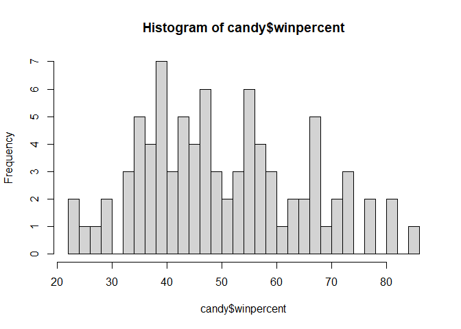

``` r
library(ggplot2)
```

    Warning: package 'ggplot2' was built under R version 4.3.3

``` r
ggplot(candy)+ 
  aes(x= winpercent)+
  geom_histogram(binwidth=8)
```

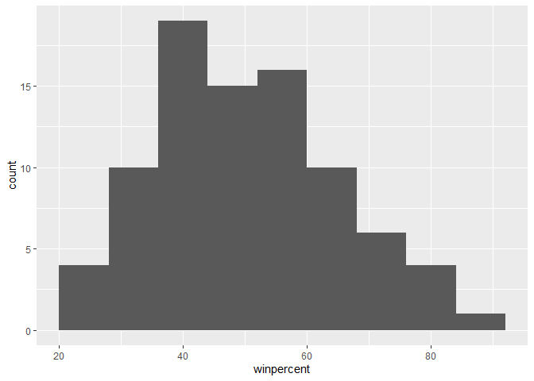

> Q9. Is the distribution of winpercent values symmetrical?

No, according to the histograms, there appears to be a skew to the left,
with a right hand tail based on the data

> Q10. Is the center of the distribution above or below 50%?

``` r
summary(candy$winpercent)
```

       Min. 1st Qu.  Median    Mean 3rd Qu.    Max. 
      22.45   39.14   47.83   50.32   59.86   84.18 

It is below 50% as we utilize the median to access the center of the
distribution, which according to the summary is less than 50%

> Q11. On average is chocolate candy higher or lower ranked than fruit
> candy?

``` r
fruit.candy<- candy |>
  filter(fruity==1)

summary(fruit.candy$winpercent)
```

       Min. 1st Qu.  Median    Mean 3rd Qu.    Max. 
      22.45   39.04   42.97   44.12   52.11   67.04 

``` r
choc.candy<- candy |>
  filter(chocolate==1)

summary(choc.candy$winpercent)
```

       Min. 1st Qu.  Median    Mean 3rd Qu.    Max. 
      34.72   50.35   60.80   60.92   70.74   84.18 

On average, chocolate candy is higher ranked as the median winpercent
score of 60.8 is greater than fruity candy’s 42.97

> Q12. Is this difference statistically significant?

``` r
t.test(choc.candy$winpercent, fruit.candy$winpercent)
```


        Welch Two Sample t-test

    data:  choc.candy$winpercent and fruit.candy$winpercent
    t = 6.2582, df = 68.882, p-value = 2.871e-08
    alternative hypothesis: true difference in means is not equal to 0
    95 percent confidence interval:
     11.44563 22.15795
    sample estimates:
    mean of x mean of y 
     60.92153  44.11974 

Yes this difference is statistically significant as p-value is much less
than 0.05 threshold value

> Q13. What are the five least liked candy types in this set?

``` r
head(candy[order(candy$winpercent),],5)
```

                       chocolate fruity caramel peanutyalmondy nougat
    Nik L Nip                  0      1       0              0      0
    Boston Baked Beans         0      0       0              1      0
    Chiclets                   0      1       0              0      0
    Super Bubble               0      1       0              0      0
    Jawbusters                 0      1       0              0      0
                       crispedricewafer hard bar pluribus sugarpercent pricepercent
    Nik L Nip                         0    0   0        1        0.197        0.976
    Boston Baked Beans                0    0   0        1        0.313        0.511
    Chiclets                          0    0   0        1        0.046        0.325
    Super Bubble                      0    0   0        0        0.162        0.116
    Jawbusters                        0    1   0        1        0.093        0.511
                       winpercent
    Nik L Nip            22.44534
    Boston Baked Beans   23.41782
    Chiclets             24.52499
    Super Bubble         27.30386
    Jawbusters           28.12744

These are the 5 least liked candies in this data set.

> Q14. What are the top 5 all time favorite candy types out of this set?

``` r
play<- c("d","a","c")
sort(play)
```

    [1] "a" "c" "d"

``` r
order(play)
```

    [1] 2 3 1

``` r
head(candy[order(candy$winpercent, decreasing = T),],5)
```

                              chocolate fruity caramel peanutyalmondy nougat
    Reese's Peanut Butter cup         1      0       0              1      0
    Reese's Miniatures                1      0       0              1      0
    Twix                              1      0       1              0      0
    Kit Kat                           1      0       0              0      0
    Snickers                          1      0       1              1      1
                              crispedricewafer hard bar pluribus sugarpercent
    Reese's Peanut Butter cup                0    0   0        0        0.720
    Reese's Miniatures                       0    0   0        0        0.034
    Twix                                     1    0   1        0        0.546
    Kit Kat                                  1    0   1        0        0.313
    Snickers                                 0    0   1        0        0.546
                              pricepercent winpercent
    Reese's Peanut Butter cup        0.651   84.18029
    Reese's Miniatures               0.279   81.86626
    Twix                             0.906   81.64291
    Kit Kat                          0.511   76.76860
    Snickers                         0.651   76.67378

These are the top 5 most liked candies

> Q15. Make a first barplot of candy ranking based on winpercent values.

Let’s do a barplot of winpercent values

``` r
ggplot(candy)+
  aes(winpercent, row.names(candy))+
  geom_col()
```

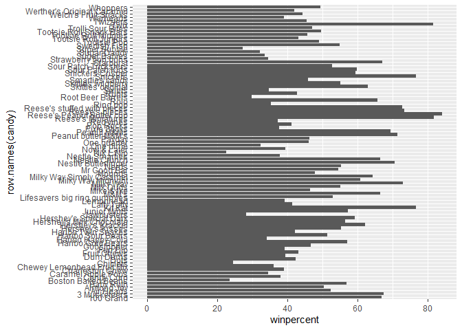

> Q16. This is quite ugly, use the reorder() function to get the bars
> sorted by winpercent?

``` r
ggplot(candy)+
  aes(winpercent, reorder(row.names(candy), winpercent), fill=chocolate)+
  geom_col()
```

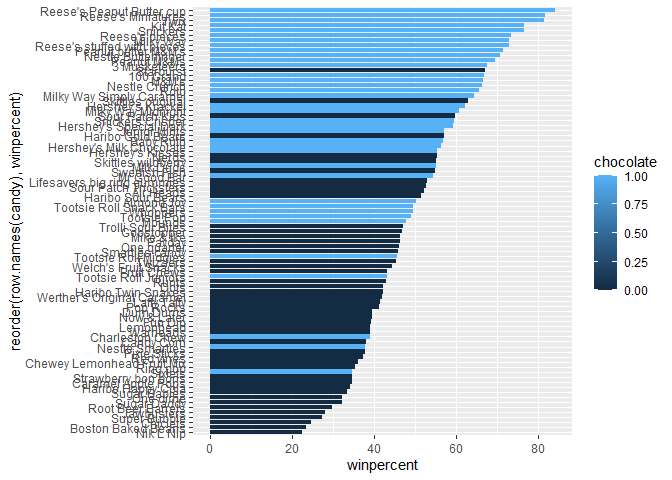

I want a more customized color scheme where I can see both chocolate and
bar and fruit from a single plot, without having to make multiple plots.
To do this we can roll our own color vector.

``` r
mycols<- rep("black", nrow(candy))
mycols[as.logical(candy$chocolate)]<- "chocolate"
mycols[as.logical(candy$bar)]<- "brown"
mycols[as.logical(candy$fruity)]<- "pink"
mycols[rownames(candy)=="Snickers"]<- "blue"
```

``` r
ggplot(candy)+
  aes(winpercent, reorder(row.names(candy), winpercent))+
  geom_col(fill=mycols)
```

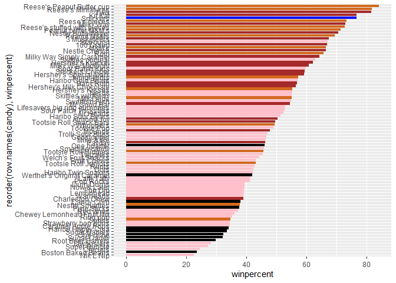

> Q17. What is the worst ranked chocolate candy?

According to the plot, the worst ranked chocolate candy is sixlets

> Q18. What is the best ranked fruity candy?

According to the plot, the best ranked fruity candy is starburst

Plot of Win Percent versus Price Percent to see what would be the best
candy to buy…

``` r
mycols[as.logical(candy$fruity)]<- "red"
```

``` r
ggplot(candy)+
  aes(winpercent, pricepercent)+
  geom_point(col=mycols)
```

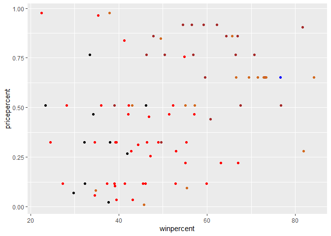

Add labels

``` r
ggplot(candy)+
  aes(winpercent, pricepercent, label=rownames(candy))+
  geom_point(col=mycols)+
  geom_label()
```

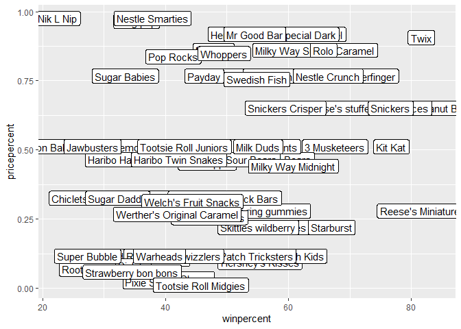

``` r
ggplot(candy)+
  aes(winpercent, pricepercent, label=rownames(candy))+
  geom_point(col=mycols)+
  geom_text(col=mycols)
```

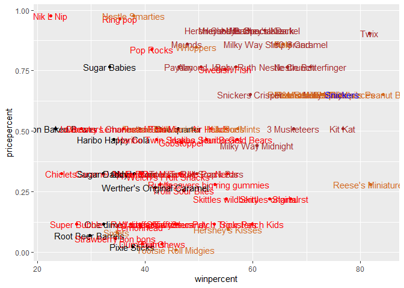

Make Labels non-overlapping

``` r
library(ggrepel)
```

    Warning: package 'ggrepel' was built under R version 4.3.3

``` r
ggplot(candy)+
  aes(winpercent, pricepercent, label=rownames(candy))+
  geom_point(col=mycols)+
  geom_text_repel(col=mycols, max.overlaps=8)
```

    Warning: ggrepel: 37 unlabeled data points (too many overlaps). Consider
    increasing max.overlaps

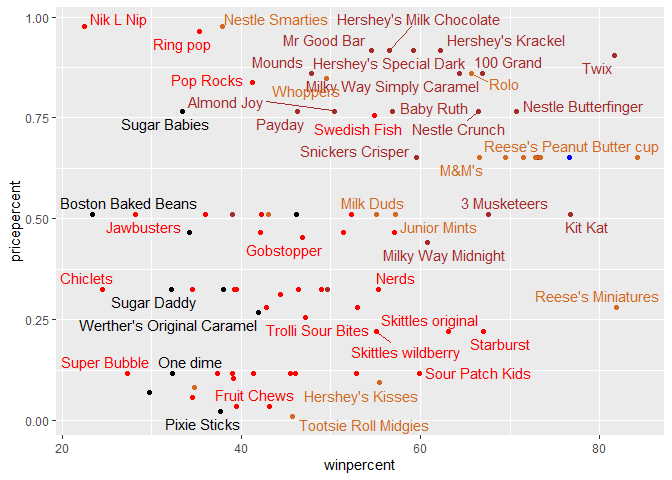

> Q19. Which candy type is the highest ranked in terms of winpercent for
> the least money - i.e. offers the most bang for your buck?

Reeses minatures are ranked highest in terms of winpercent for the least
money according to the plot above

> Q20. What are the top 5 most expensive candy types in the dataset and
> of these which is the least popular?

``` r
ord <- order(candy$pricepercent, decreasing = TRUE)
head( candy[ord,c(11,12)], n=5 )
```

                             pricepercent winpercent
    Nik L Nip                       0.976   22.44534
    Nestle Smarties                 0.976   37.88719
    Ring pop                        0.965   35.29076
    Hershey's Krackel               0.918   62.28448
    Hershey's Milk Chocolate        0.918   56.49050

The top 5 most expensive candy types are Nik L Nip, Ring pops, Smarties,
Hersheys Krackel, and Hersheys chocolate, with Nik L Nip being the least
popular of them all.

> Q21. Make a barplot again with geom_col() this time using pricepercent
> and then improve this step by step, first ordering the x-axis by value
> and finally making a so called “dot chat” or “lollipop” chart by
> swapping geom_col() for geom_point() + geom_segment().

``` r
ggplot(candy) +
  aes(pricepercent, reorder(rownames(candy), pricepercent)) +
  geom_segment(aes(yend = reorder(rownames(candy), pricepercent), 
                   xend = 0), col="gray40") +
    geom_point()
```

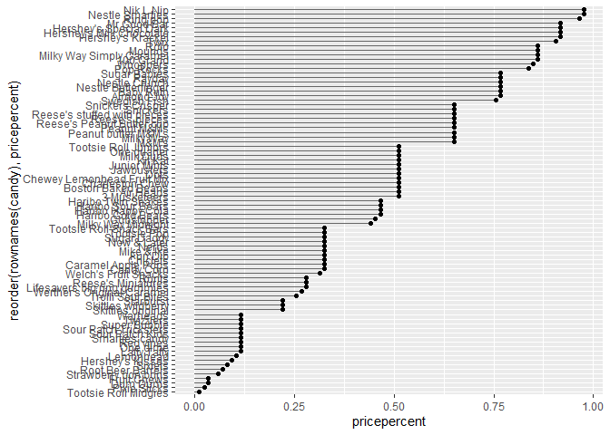

\##Exploring the Correlation Structure

``` r
library(corrplot)
```

    Warning: package 'corrplot' was built under R version 4.3.3

    corrplot 0.95 loaded

``` r
cij<- cor(candy)
corrplot(cij)
```


> Q22. Examining this plot what two variables are anti-correlated
> (i.e. have minus values)?

Chocolate and fruity are anticorrelated based on the correlation
structure

> Q23. Similarly, what two variables are most positively correlated?

Chocolate and win percentage are most positively correlated based on the
correlation structure

\##Principal Component Analysis

``` r
pca<- prcomp(candy, scale=T)
summary(pca)
```

    Importance of components:
                              PC1    PC2    PC3     PC4    PC5     PC6     PC7
    Standard deviation     2.0788 1.1378 1.1092 1.07533 0.9518 0.81923 0.81530
    Proportion of Variance 0.3601 0.1079 0.1025 0.09636 0.0755 0.05593 0.05539
    Cumulative Proportion  0.3601 0.4680 0.5705 0.66688 0.7424 0.79830 0.85369
                               PC8     PC9    PC10    PC11    PC12
    Standard deviation     0.74530 0.67824 0.62349 0.43974 0.39760
    Proportion of Variance 0.04629 0.03833 0.03239 0.01611 0.01317
    Cumulative Proportion  0.89998 0.93832 0.97071 0.98683 1.00000

``` r
plot(pca$x[,1],pca$x[,2], col=mycols, pch=16)
```

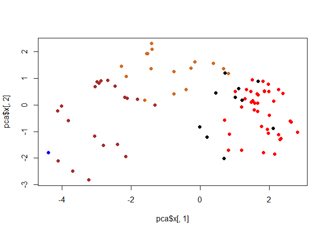

How do the original columns contribute to the new PCs. I will look at
PC1 first here

``` r
loadings<- as.data.frame(pca$rotation)

ggplot(loadings)+
  aes(PC1, reorder(rownames(loadings), PC1), fill=PC1) +
  geom_col()
```

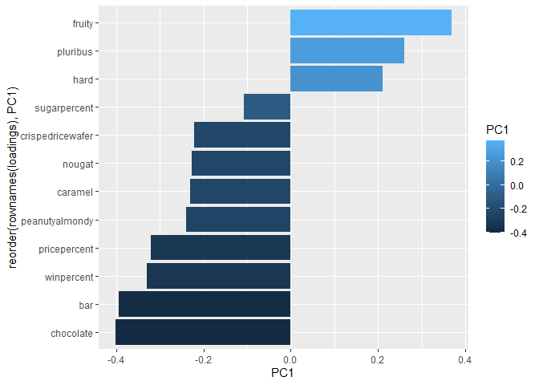

\##ggplot of PCA

``` r
my_data <- cbind(candy, pca$x[,1:3]) 
p <- ggplot(my_data) + 
        aes(x=PC1, y=PC2, 
            size=winpercent/100,  
            text=rownames(my_data),
            label=rownames(my_data)) +
        geom_point(col=mycols)

p
```

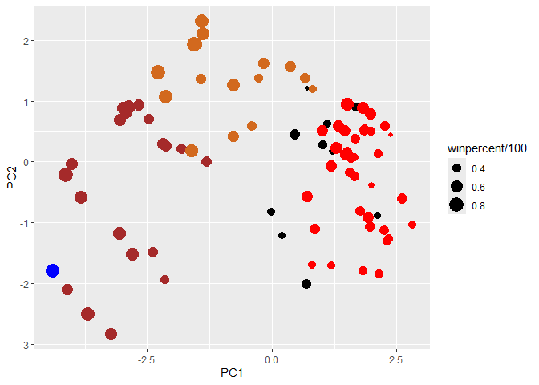

``` r
library(ggrepel)

p + geom_text_repel(size=3.3, col=mycols, max.overlaps = 7)  + 
  theme(legend.position = "none") +
  labs(title="Halloween Candy PCA Space",
       subtitle="Colored by type: chocolate bar (dark brown), chocolate other (light brown), fruity (red), other (black)",
       caption="Data from 538")
```

    Warning: ggrepel: 43 unlabeled data points (too many overlaps). Consider
    increasing max.overlaps

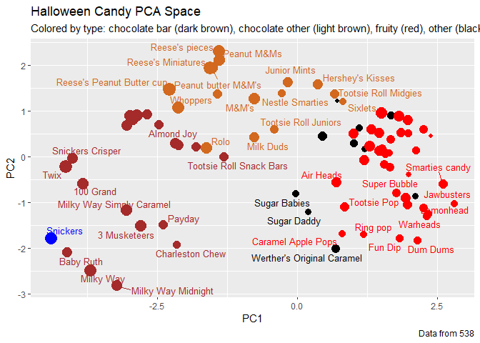

``` r
par(mar=c(8,4,2,2))
barplot(pca$rotation[,1], las=2, ylab="PC1 Contribution")
```


> Q24. What original variables are picked up strongly by PC1 in the
> positive direction? Do these make sense to you?

PC1 strongly picks up fruity, hard, and pluribus in the positive
direction as these variables are all positioned on the positive right
side of PC1 loadings plot compared to all other variables being
positioned on the left, negative side of the loadings plot. This makes
sense to me as naturally, hard, fruity, candy are commonly found related
to each other as well as being pluribus (bagged), and their close
relationship via the PC1 plot support this real world finding
statistically.
