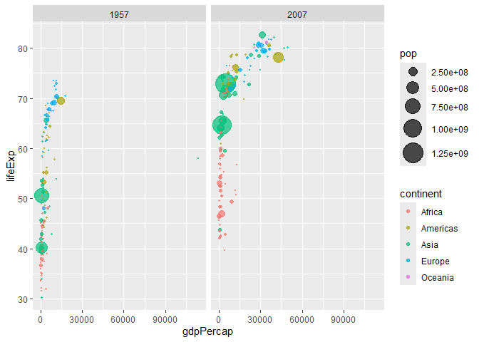

# Class 5: Data Viz with ggplot
Ian Gurholt (PID A16767484)

## Plotting in R

RR has lot’s of ways to make plots and figures. This includes so-called
**base** graphics and packages like **ggplot**

``` r
plot(cars)
```


This is a **base** R plot of the in-built `cars` dataset that has only
two columns

``` r
head(cars)
```

      speed dist
    1     4    2
    2     4   10
    3     7    4
    4     7   22
    5     8   16
    6     9   10

> Q. How would we plot this data set with **ggplot2**?

All ggplot figures have at least 3 layers:

-data -aesthetics (how the data map to the plot) - geoms (how we draw
the plot, lines, points, etc.)

Before I use any new package I need to download and install it with the
`install.packages()` command.

I never use `install.packages()` within my quarto document otherwise I
will install the package over and over and over again - which is silly!

Once a package is installed I can load it up with the `library()`
function

> Q1. For which phases is data visualization important in our scientific
> workflows?

All the above (Communication of Results, EDA, Detection of Outliers)

> Q2. True or False? The ggplot2 package comes already installed with R?

FALSE

> Q3. Which plot types are typically NOT used to compare distributions
> of numeric variables?

Network Graphs

> Q4. Which statement about data visualization with ggplot2 is
> incorrect?

ggplot2 is the only way to create plots in R

> Q5. Which geometric layer should be used to create scatter plots in
> ggplot2?

geom_point()

``` r
#install.packages(ggplot2)
library(ggplot2)
```

    Warning: package 'ggplot2' was built under R version 4.3.3

``` r
ggplot(cars)+
  aes(x=speed, y=dist)+
  geom_point()
```


Key point: For simple plots (like the one above) ggplot is more verbose
(without need to do more typing) but as plots get more complicated
ggplot starts to be more clear and simple than base R plot( )

> Q6. In your own RStudio can you add a trend line layer to help show
> the relationship between the plot variables with the geom_smooth()
> function?

Refer to code for scatterplot

> Q7. Argue with geom_smooth() to add a straight line from a linear
> model without the shaded standard error region?

Refer to code for scatterplot

> Q8. Can you finish this plot by adding various label annotations with
> the labs() function and changing the plot look to a more conservative
> “black & white” theme by adding the theme_bw() function?

Refer to code for scatterplot

``` r
library(ggplot2)
ggplot(cars)+
  aes(speed,dist)+
  geom_point()+
  geom_smooth(se=FALSE, method=lm )+
  labs(title="Stopping distance of old cars", 
       subtitle = "From the in-built cars dataset")+
  theme_bw()
```

    `geom_smooth()` using formula = 'y ~ x'


``` r
url <- "https://bioboot.github.io/bimm143_S20/class-material/up_down_expression.txt"
genes <- read.delim(url)
head(genes)
```

            Gene Condition1 Condition2      State
    1      A4GNT -3.6808610 -3.4401355 unchanging
    2       AAAS  4.5479580  4.3864126 unchanging
    3      AASDH  3.7190695  3.4787276 unchanging
    4       AATF  5.0784720  5.0151916 unchanging
    5       AATK  0.4711421  0.5598642 unchanging
    6 AB015752.4 -3.6808610 -3.5921390 unchanging

> Q9. Use the nrow() function to find out how many genes are in this
> dataset. What is your answer?

``` r
nrow(genes)
```

    [1] 5196

There are 5196 genes in this dataset

> Q10. Use the colnames() function and the ncol() function on the genes
> data frame to find out what the column names are (we will need these
> later) and how many columns there are. How many columns did you find?

``` r
colnames(genes)
```

    [1] "Gene"       "Condition1" "Condition2" "State"     

``` r
ncol(genes)
```

    [1] 4

I found 4 columns in this dataset

> Q11. Use the table() function on the State column of this data.frame
> to find out how many ‘up’ regulated genes there are. What is your
> answer?

``` r
table(genes$State)
```


          down unchanging         up 
            72       4997        127 

There are 127 upregulated genes

> Q12. Using your values above and 2 significant figures. What fraction
> of total genes is up-regulated in this dataset?

``` r
round(table(genes$State)/nrow(genes) * 100, 2 )
```


          down unchanging         up 
          1.39      96.17       2.44 

2.44% of genes are upregulated in this data set

> Q13. Complete the code below to produce the following plot

``` r
ggplot(genes) + 
    aes(x=Condition1, y=Condition2) +
    geom_point()
```


``` r
p <- ggplot(genes) + 
    aes(x=Condition1, y=Condition2, col=State) +
    geom_point()
p
```


``` r
p + scale_colour_manual( values=c("blue","gray","red") )
```


> Q14. Nice, now add some plot annotations to the p object with the
> labs() function so your plot looks like the following:

``` r
p + labs(title = "Gene Expression Changes Upon Drug Treatment", x = "Control (no drug)", y= "Drug Treatment") + scale_colour_manual(values=c("blue","gray","red"))
```


``` r
url <- "https://raw.githubusercontent.com/jennybc/gapminder/master/inst/extdata/gapminder.tsv"

gapminder <- read.delim(url)
```

``` r
library(dplyr)
```


    Attaching package: 'dplyr'

    The following objects are masked from 'package:stats':

        filter, lag

    The following objects are masked from 'package:base':

        intersect, setdiff, setequal, union

``` r
gapminder_2007 <- gapminder %>% filter(year==2007)
```

> Q15. Complete the code below to produce a first basic scater plot of
> this gapminder_2007 dataset:

``` r
library(ggplot2)
ggplot(gapminder_2007) +
  aes(x=gdpPercap, y=lifeExp, color=continent, size=pop) +
  geom_point(alpha=0.5)
```


``` r
ggplot(gapminder_2007) + 
  aes(x = gdpPercap, y = lifeExp, color = pop) +
  geom_point(alpha=0.8)
```


``` r
ggplot(gapminder_2007) + 
  aes(x = gdpPercap, y = lifeExp, size = pop) +
  geom_point(alpha=0.5)+
  scale_size_area(max_size = 10)
```


> Q16. Can you adapt the code you have learned thus far to reproduce our
> gapminder scatter plot for the year 1957? What do you notice about
> this plot is it easy to compare with the one for 2007?

``` r
library(dplyr)

gapminder_1957 <- gapminder %>% filter(year==1957)

ggplot(gapminder_1957)+
  aes(x = gdpPercap, y = lifeExp, color=continent, size=pop)+
  geom_point(alpha=0.7)+
  scale_size_area(max_size = 15)
```


Without having both plots next to each other, or overlapping on the same
graph, it is difficult to decipher the small differences between the two
years as scrolling up and down to see each graph individually is
inefficient and not very precise

> Q17. Do the same steps above but include 1957 and 2007 in your input
> dataset for ggplot(). You should now include the layer
> facet_wrap(~year) to produce the following plot:

``` r
gapminder_1957 <- gapminder %>% filter(year==1957 | year==2007)

ggplot(gapminder_1957)+
  aes(x = gdpPercap, y = lifeExp, color=continent, size=pop)+
  geom_point(alpha=0.7)+
  scale_size_area(max_size = 10)+
  facet_wrap(~year)
```



. Q. Extract data for US in 1992

``` r
filter(gapminder, country=="United States", 
       year==1992)
```

            country continent year lifeExp       pop gdpPercap
    1 United States  Americas 1992   76.09 256894189  32003.93

What was the population of Ireland in the last year we have data for?

``` r
filter(gapminder, country=="Ireland", 
       year==2007)
```

      country continent year lifeExp     pop gdpPercap
    1 Ireland    Europe 2007  78.885 4109086     40676

> Q. What countries in the data set had pop smaller than Ireland in 2007

``` r
gap07 <- filter(gapminder, year==2007)
ire_pop <- filter(gap07,country=="Ireland")["pop"]
ire_pop
```

          pop
    1 4109086

``` r
filter(gap07, pop<4109086)
```

                     country continent year lifeExp     pop  gdpPercap
    1                Albania    Europe 2007  76.423 3600523  5937.0295
    2                Bahrain      Asia 2007  75.635  708573 29796.0483
    3               Botswana    Africa 2007  50.728 1639131 12569.8518
    4                Comoros    Africa 2007  65.152  710960   986.1479
    5            Congo, Rep.    Africa 2007  55.322 3800610  3632.5578
    6               Djibouti    Africa 2007  54.791  496374  2082.4816
    7      Equatorial Guinea    Africa 2007  51.579  551201 12154.0897
    8                  Gabon    Africa 2007  56.735 1454867 13206.4845
    9                 Gambia    Africa 2007  59.448 1688359   752.7497
    10         Guinea-Bissau    Africa 2007  46.388 1472041   579.2317
    11               Iceland    Europe 2007  81.757  301931 36180.7892
    12               Jamaica  Americas 2007  72.567 2780132  7320.8803
    13                Kuwait      Asia 2007  77.588 2505559 47306.9898
    14               Lebanon      Asia 2007  71.993 3921278 10461.0587
    15               Lesotho    Africa 2007  42.592 2012649  1569.3314
    16               Liberia    Africa 2007  45.678 3193942   414.5073
    17            Mauritania    Africa 2007  64.164 3270065  1803.1515
    18             Mauritius    Africa 2007  72.801 1250882 10956.9911
    19              Mongolia      Asia 2007  66.803 2874127  3095.7723
    20            Montenegro    Europe 2007  74.543  684736  9253.8961
    21               Namibia    Africa 2007  52.906 2055080  4811.0604
    22                  Oman      Asia 2007  75.640 3204897 22316.1929
    23                Panama  Americas 2007  75.537 3242173  9809.1856
    24           Puerto Rico  Americas 2007  78.746 3942491 19328.7090
    25               Reunion    Africa 2007  76.442  798094  7670.1226
    26 Sao Tome and Principe    Africa 2007  65.528  199579  1598.4351
    27              Slovenia    Europe 2007  77.926 2009245 25768.2576
    28             Swaziland    Africa 2007  39.613 1133066  4513.4806
    29   Trinidad and Tobago  Americas 2007  69.819 1056608 18008.5092
    30               Uruguay  Americas 2007  76.384 3447496 10611.4630
    31    West Bank and Gaza      Asia 2007  73.422 4018332  3025.3498

\*\* OPTIONAL BAR CHARTS\*\*

``` r
gapminder_top5 <- gapminder %>% 
  filter(year==2007) %>% 
  arrange(desc(pop)) %>% 
  top_n(5, pop)

gapminder_top5
```

            country continent year lifeExp        pop gdpPercap
    1         China      Asia 2007  72.961 1318683096  4959.115
    2         India      Asia 2007  64.698 1110396331  2452.210
    3 United States  Americas 2007  78.242  301139947 42951.653
    4     Indonesia      Asia 2007  70.650  223547000  3540.652
    5        Brazil  Americas 2007  72.390  190010647  9065.801

``` r
ggplot(gapminder_top5) + 
  geom_col(aes(x = country, y = pop))
```


> Q18. Create a bar chart showing the life expectancy of the five
> biggest countries by population in 2007.

``` r
ggplot(gapminder_top5) + 
  geom_col(aes(x = country, y = lifeExp))
```


``` r
ggplot(gapminder_top5) + 
  geom_col(aes(x = country, y = pop, fill = continent))
```


``` r
ggplot(gapminder_top5) + 
  geom_col(aes(x = country, y = pop, fill = lifeExp))
```


> Q19. Plot population size by country. Create a bar chart showing the
> population (in millions) of the five biggest countries by population
> in 2007.

``` r
ggplot(gapminder_top5) +
  aes(x=reorder(country, -pop), y=pop, fill=country) +
  geom_col(col="gray30") +
  guides(fill="none")
```


